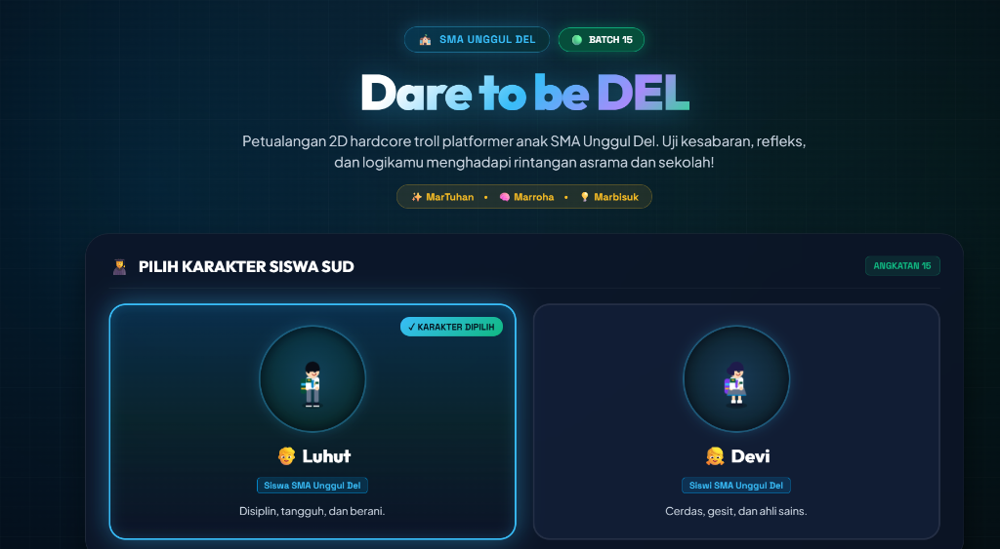

# 🎮 Dare to be DEL — 2D Hardcore Troll Platformer

[](https://dare-to-be-del.netlify.app/)
[](https://smadel.sch.id/)
[](https://developer.mozilla.org/en-US/docs/Web/API/Canvas_API)
[](https://developer.mozilla.org/en-US/docs/Web/JavaScript)


> 🕹️ **Mainkan Game Sekarang:** Kunjungi dan mainkan langsung melalui browser di [**https://dare-to-be-del.netlify.app/**](https://dare-to-be-del.netlify.app/)

---

## 📖 Tentang Game

**Dare to be DEL** adalah game *2D hardcore troll platformer* yang terinspirasi dari kehidupan siswa di **SMA Unggul Del (Batch 15)**. Uji kesabaran, kecepatan refleks, dan kecerdikan logikamu dalam menaklukkan rintangan tak terduga, jebakan tersembunyi (*troll traps*), dan teka-teki platforming yang menantang!

Game ini mengusung falsafah luhur **3M** SMA Unggul Del:
- ✨ **MarTuhan** *(Beriman & Bertakwa)*
- 🧠 **Marroha** *(Berhati nurani & Berkarakter)*
- 💡 **Marbisuk** *(Bijaksana & Cerdas)*

---

## 🧑‍🎓 Karakter yang Dapat Dimainkan

Pilih karakter favoritmu sebelum memulai petualangan:

| Karakter | Peran | Karakteristik |
| :---: | :---: | :--- |
| 🧑‍🎓 **Laut Pangaribuan** | Siswa SMA Unggul Del | Disiplin, tangguh, pantang menyerah, dan berani menghadapi segala jebakan. |
| 👩‍🎓 **Biru Sinaga** | Siswi SMA Unggul Del | Cerdas, gesit, analitis, dan ahli dalam memecahkan teka-teki platforming sains. |

---

## 🌟 Fitur Utama

- ⚠️ **Hardcore Troll Mechanics**: Jebakan duri mendadak, balok jatuh tanpa aba-aba, lompatan presisi tinggi, dan tantangan yang menguji mental serta kesabaran!
- 💎 **SUD Gem & Goal Door**: Kumpulkan permata SUD yang tersebar di sepanjang lintasan dan temukan **Pintu Keluar SUD** untuk menyelesaikan setiap level.
- 🎵 **Custom Web Audio Synthesizer**: Efek suara arcade retro dan background music yang dihasilkan secara sintetis via *Web Audio API* tanpa perlu file audio berat.
- 🎨 **Pixel Art & Grid Aesthetics**: Visual bernuansa futuristik dengan palet warna khas *Biru Navy, Cyan, Ungu, dan Hijau Botol*.
- 📱 **Multi-Platform Controls**: Mendukung kontrol keyboard untuk PC/Laptop serta tombol sentuh (*On-Screen D-Pad & Action Buttons*) untuk perangkat mobile/smartphone.

---

## 📸 Tangkapan Layar (Screenshots)

### 1. Menu Utama & Pemilihan Karakter
Tampilan beranda yang modern dengan pilihan karakter Siswa/Siswi SUD serta badge resmi Angkatan 15.


---

### 2. Aksi Gameplay & Rintangan Hardcore
Selesaikan level dengan menghindari jebakan tajam, mengambil kristal, dan mencapai pintu SUD.



---

## 🎮 Kontrol Permainan

### Kontrol Keyboard (Desktop):
- **A / Panah Kiri (`←`)**: Bergerak ke Kiri
- **D / Panah Kanan (`→`)**: Bergerak ke Kanan
- **W / Spasi / Panah Atas (`↑`)**: Melompat (*Jump*)
- **R**: Restart Level Cepat (*Retry*)
- **ESC / P**: Pause Menu

### Kontrol Mobile:
- Gunakan tombol virtual *D-Pad Kiri / Kanan* dan tombol *Jump* yang muncul otomatis pada layar smartphone/tablet.

---

## 🛠️ Arsitektur & Teknologi

- **Frontend & Render Engine:** HTML5 Canvas, Vanilla JavaScript (Custom 2D Physics Engine, Collision Detection, Sprite Generator)
- **Audio Engine:** HTML5 Web Audio API (Chiptune Sound Synthesis)
- **Styling:** Vanilla CSS3 (Custom Responsive Layout, Modern Glow Effects, Glassmorphism)
- **Deployment & Hosting:** [Netlify](https://www.netlify.com/)

---

## 🚀 Menjalankan Proyek Secara Lokal

1. **Clone repository ini:**
   ```bash
   git clone https://github.com/feri-abiel00/dare-to-be-del.git
   cd dare-to-be-del
   ```

2. **Jalankan web server lokal:**
   Anda bisa menggunakan ekstensi *Live Server* di VS Code, atau menggunakan perintah Python/Node:
   ```bash
   # Menggunakan Python
   python -m http.server 8000

   # Atau menggunakan npx serve
   npx serve .
   ```

3. **Buka di browser:**
   Buka `http://localhost:8000` pada peramban web favorit Anda.

---

## 🌐 Tautan Resmi

- **Live Game (Play Online):** [https://dare-to-be-del.netlify.app/](https://dare-to-be-del.netlify.app/)
- **GitHub Repository:** [https://github.com/feri-abiel00/dare-to-be-del](https://github.com/feri-abiel00/dare-to-be-del)

---

## 📜 Lisensi & Kredit

Dikembangkan untuk proyek game edukasi dan pelatihan pembelajaran AI SMA Unggul Del & IT Del.
